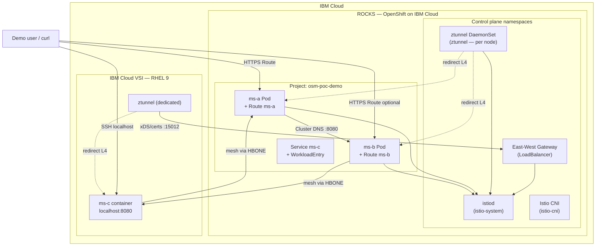

# Deployment Architecture

This document shows **where each component runs** in the OSM 3.2 ambient PoC on IBM Cloud (ROCKS + VSI).

## Physical / logical placement

## Component table

| Component | Location | Network | Exposure |
|---|---|---|---|
| Sail Operator / OSM 3.2 | ROCKS `openshift-operators` | `main-network` | Internal |
| `istiod` | ROCKS `istio-system` | `main-network` | Via east-west gateway to VSI |
| `ztunnel` (DaemonSet) | Every ROCKS worker node | `main-network` | Node-internal |
| East-west gateway | ROCKS `istio-system` | `main-network` / public LB | `15012`, `15017`, `15008` |
| **ms-a** | ROCKS `osm-poc-demo` | `main-network` | OpenShift **Route** |
| **ms-b** | ROCKS `osm-poc-demo` | `main-network` | OpenShift **Route** |
| **ms-c** | IBM Cloud **VSI** | `vsi-network` | **localhost:8080** (+ VSI IP for mesh) |
| `ztunnel` (dedicated) | VSI | `vsi-network` | Outbound to EW gateway |
| `WorkloadEntry` | ROCKS API (represents VSI) | — | Registers VSI IP |

## Networks

| Name | Description |
|---|---|
| `main-network` | OpenShift pod network (ROCKS) |
| `vsi-network` | VSI LAN / VPC (no direct pod routing) |

Cross-network traffic uses the **east-west gateway** and HBONE (TCP **15008**). The VSI maps `istiod.istio-system.svc` to the gateway hostname in `/etc/hosts`.

## Image registry

All application images are built from Red Hat **OpenJDK 21** runtime (`registry.access.redhat.com/ubi9/openjdk-21-runtime`) and pushed to **Quay.io** via [`microservices/build-and-push.sh`](../microservices/build-and-push.sh).
