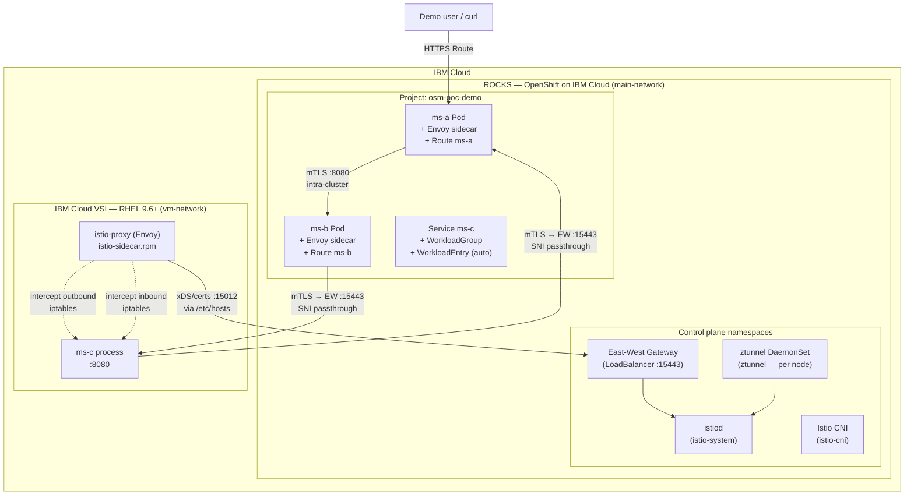

# Deployment Architecture

This document shows **where each component runs** in the OSM 3.3 ambient PoC on IBM Cloud (ROCKS + VSI).

## Physical / logical placement



## Traffic flow detail

### A → B (intra-cluster, both sidecar)

```
ms-a app → ms-a Envoy (outbound :15001)
  → ms-b Envoy (inbound :15006)
  → ms-b app
```

Both pods have `sidecar.istio.io/inject: "true"` and `ambient.istio.io/redirection: disabled`.
mTLS is handled end-to-end by the Envoy sidecars.

### B → C (cluster → VSI, cross-network)

```
ms-b Envoy (outbound)
  → EW gateway :15443  [AUTO_PASSTHROUGH, SNI: outbound_.8080_._.ms-c....]
  → VSI :8080          [iptables PREROUTING → Envoy :15006 → ms-c app]
```

Istiod pushes `ms-c`'s WorkloadEntry IP (`161.156.86.195:8080`) with `TLSMode: istio`
as the EDS endpoint for cluster proxies. mTLS is established directly (no EW gateway hop
is needed since `vm-network` has no gateway defined in `meshNetworks`).

### C → A (VSI → cluster, cross-network)

```
ms-c app → VSI Envoy (outbound iptables → :15001)
  → EW gateway :15443  [AUTO_PASSTHROUGH, SNI: outbound_.8080_._.ms-a....]
  → ms-a Envoy :15006
  → ms-a app
```

Istiod pushes the EW gateway's external IPs (`158.177.15.125:15443` and `161.156.163.1:15443`)
as the EDS endpoint for `ms-a` to the VM proxy.  
This works because ms-a has `TLSMode: istio` (sidecar mode).  
The EW gateway's `cross-network-gateway` resource uses `AUTO_PASSTHROUGH` on port 15443.

## Component table

| Component | Location | Network | Exposure |
|---|---|---|---|
| Sail Operator / OSM 3.3 | ROCKS `openshift-operators` | `main-network` | Internal |
| `istiod` | ROCKS `istio-system` | `main-network` | Via east-west gateway to VSI (port 15012) |
| `ztunnel` (DaemonSet) | Every ROCKS worker node | `main-network` | Node-internal (not used by sidecar pods) |
| East-west gateway | ROCKS `istio-system` | `main-network` / public LB | `:15012`, `:15017`, `:15443` |
| **ms-a** | ROCKS `osm-poc-demo` | `main-network` | OpenShift **Route** + Envoy sidecar |
| **ms-b** | ROCKS `osm-poc-demo` | `main-network` | Envoy sidecar |
| **ms-c** | IBM Cloud **VSI** | `vm-network` | Envoy sidecar via `istio-sidecar.rpm` |
| `WorkloadEntry` | ROCKS API (auto-registered) | — | Represents VSI IP `161.156.86.195` |

## Networks

| Name | Description |
|---|---|
| `main-network` | OpenShift pod network (ROCKS) |
| `vm-network` | IBM Cloud VSI VPC subnet |

Cross-network traffic uses the **east-west gateway** on port **15443** (`AUTO_PASSTHROUGH` TLS mode).  
The VSI maps `istiod.istio-system.svc` to the EW gateway IP in `/etc/hosts` for xDS connectivity.

## Image registry

All application images are built from Red Hat **OpenJDK 21** runtime (`registry.access.redhat.com/ubi9/openjdk-21-runtime`) and pushed to **Quay.io** via [`microservices/build-and-push.sh`](../microservices/build-and-push.sh).
