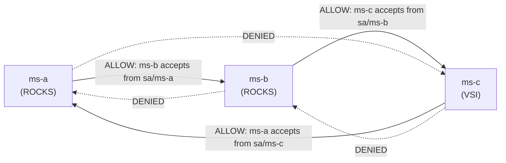

# Communication Policy (Who May Talk to Whom)

## Allowed call graph

The demo enforces a **directed ring**: **A → B → C → A**. No other calls are permitted at the mesh layer.



## Matrix

| Source ↓ / Target → | ms-a | ms-b | ms-c |
|---|---|---|---|
| **ms-a** | — | ✅ allowed | ❌ denied |
| **ms-b** | ❌ denied | — | ✅ allowed |
| **ms-c** | ✅ allowed | ❌ denied | — |
| External (Route) | ✅ allowed | ✅ allowed (Route exposed) | ❌ (not on Route) |

**Note on external traffic:** the OpenShift Route ingress has no Istio identity, so the `ms-a-allow-ingress` policy explicitly permits calls with `notPrincipals: ["*"]` in addition to the `sa/ms-c` rule. This allows health checks and demos via `curl`/browser while preserving mTLS enforcement for in-mesh calls.

## Implementation

Policies live in [`03-deploy-microservices/06-authorization-policies.yaml`](../03-deploy-microservices/06-authorization-policies.yaml):

| Policy | Workload | Rule |
|---|---|---|
| `ms-b-allow-from-a` | `app=ms-b` | ALLOW if source principal is `sa/ms-a` |
| `ms-c-allow-from-b` | `app=ms-c` | ALLOW if source principal is `sa/ms-b` |
| `ms-a-allow-ingress` | `app=ms-a` | ALLOW if source principal is `sa/ms-c` OR source has no principal (Route) |

Enforcement point: **Envoy sidecar** on each pod and on the VSI (`istio-sidecar.rpm`).

## Application-level chain

HTTP flow for `GET /api/run-chain` on ms-a:

```text
ms-a  --CALL_B-->  ms-b:/api/handle-from-a
ms-b  --CALL_C-->  ms-c:/api/handle-from-b
ms-c  --CALL_A-->  ms-a:/api/handle-from-c
```

Each hop propagates header `X-Trace-Id` for correlated logs.

## mTLS

All three services run with Envoy sidecar injection (`sidecar.istio.io/inject: "true"`, `ambient.istio.io/redirection: disabled`).

- **A ↔ B** (intra-cluster): standard Envoy mTLS end-to-end (port 8080, sidecar-to-sidecar).
- **B → C** (cluster → VSI): direct mTLS to the WorkloadEntry IP (`161.156.86.195:8080`). The VSI iptables rules redirect inbound port 8080 to Envoy port 15006.
- **C → A** (VSI → cluster): VSI Envoy routes via the east-west gateway port **15443** (`AUTO_PASSTHROUGH`). Istiod pushes the EW gateway's external IPs as endpoints for `ms-a` to the VM proxy because `ms-a` is on `main-network`.
