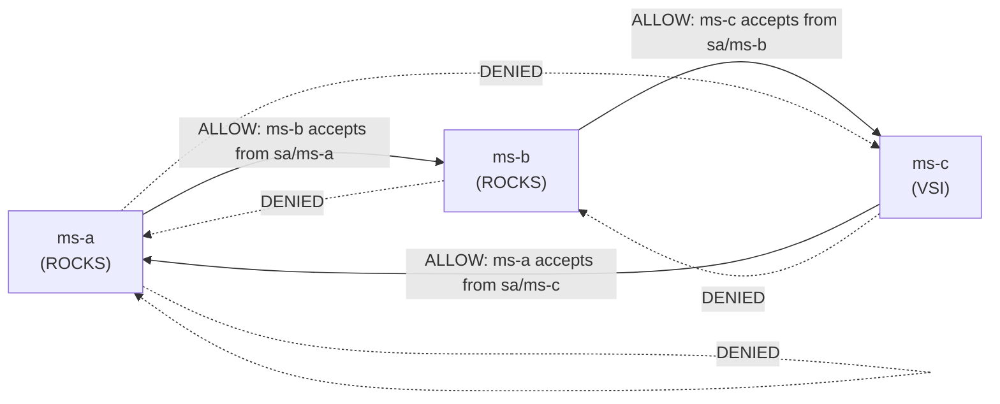

# Communication Policy (Who May Talk to Whom)

## Allowed call graph

The demo enforces a **directed ring**: **A → B → C → A**. No other calls are permitted at the mesh L4 layer.



## Matrix

| Source ↓ / Target → | ms-a | ms-b | ms-c |
|---|---|---|---|
| **ms-a** | — | ✅ allowed | ❌ denied |
| **ms-b** | ❌ denied | — | ✅ allowed |
| **ms-c** | ✅ allowed | ❌ denied | — |
| External (Route) | ⚠️ see note | ⚠️ see note | ❌ (not on Route) |

**Note:** L4 `AuthorizationPolicy` uses workload identities (SPIFFE). Calls from an OpenShift Route use the ingress gateway identity, not `sa/ms-a`. For policy-correct tests, use an in-mesh client ([`05-verify-and-trace`](../05-verify-and-trace/)). Routes remain useful for health checks and application demos.

## Implementation

Policies live in [`03-deploy-microservices/06-authorization-policies.yaml`](../03-deploy-microservices/06-authorization-policies.yaml):

| Policy | Workload | Rule |
|---|---|---|
| `ms-b-allow-from-a` | `app=ms-b` | ALLOW if source principal is `sa/ms-a` |
| `ms-c-allow-from-b` | `app=ms-c` | ALLOW if source principal is `sa/ms-b` |
| `ms-a-allow-from-c` | `app=ms-a` | ALLOW if source principal is `sa/ms-c` |

Enforcement point: **ztunnel** (ambient L4) on source and destination nodes/VSI.

## Application-level chain

HTTP flow for `GET /api/run-chain` on ms-a:

```text
ms-a  --CALL_B-->  ms-b:/api/handle-from-a
ms-b  --CALL_C-->  ms-c:/api/handle-from-b
ms-c  --CALL_A-->  ms-a:/api/handle-from-c
```

Each hop propagates header `X-Trace-Id` for correlated logs.

## mTLS

Ambient mode encrypts traffic between enrolled workloads using **HBONE** over **mTLS** (port **15008**). No application code changes are required.
